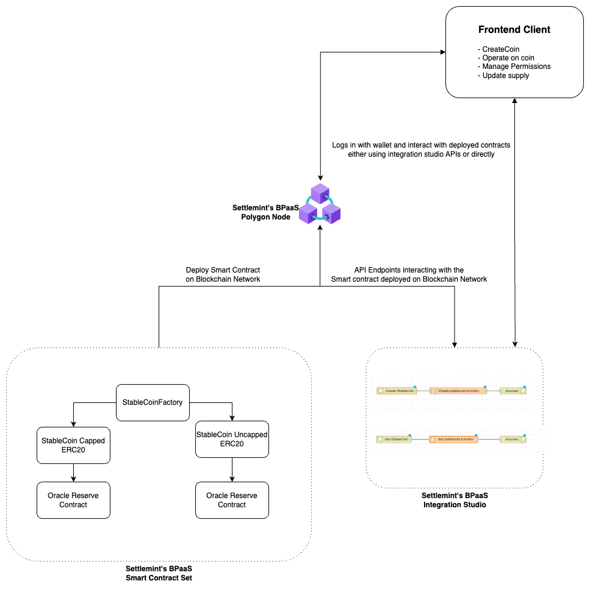

# Stablecoin Project

This project contains smart contracts for a stablecoin implementation and a deployment script using Hardhat Ignition.

## Architecture

The architecture of the project is as follows:



## Smart Contracts

The smart contracts for this project are located in the `@contracts` folder. Here's a brief overview of each contract:

1. `StableCoin.sol`: The main stablecoin contract that implements ERC20 functionality with pausable and access control features.

2. `StableCoinFactory.sol`: A factory contract for deploying new stablecoin instances.

3. `StableCoinCapped.sol`: An extension of the stablecoin contract that includes a supply cap.

4. `ReserveConsumerV3.sol`: A contract that interacts with Chainlink price feeds to get reserve data.

## Deployment Script

The deployment script for the StableCoinFactory is located in `@ignition/modules/main.ts`. This script uses Hardhat Ignition for deploying the contract.

To deploy the StableCoinFactory contract:

1. Make sure you have Hardhat and Hardhat Ignition installed.
2. Run the following command:

```bash
npx hardhat run @ignition/modules/main.ts --network <network-name>
```

Replace `<network-name>` with the name of the network you want to deploy to.

This will deploy the StableCoinFactory contract using the first account as the deployer and initial owner.

## Dependencies

This project uses OpenZeppelin contracts and Chainlink contracts. To install the required dependencies, run:

```bash
npm install @openzeppelin/contracts@v4.9.5 @chainlink/contracts@v0.8
```

Make sure to have these dependencies installed before compiling and deploying the contracts.

## Note

The current implementation uses Solidity version 0.8.27. Ensure your development environment supports this version.
